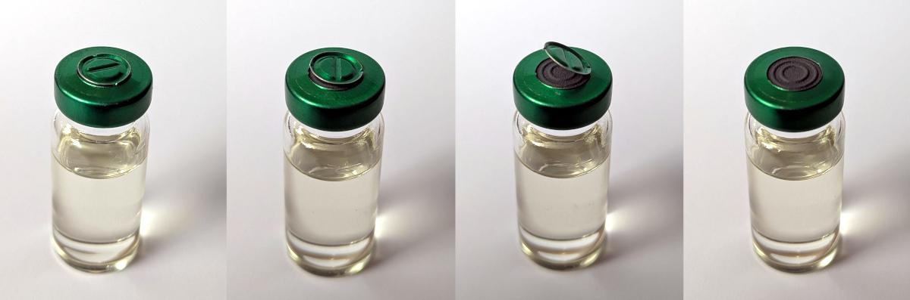
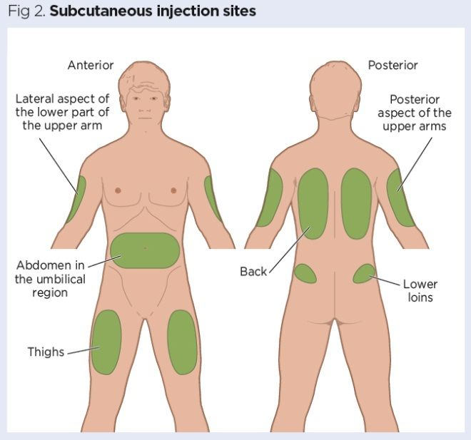

# Injections : la méthode

## Ouvrir sa fiole la première fois
La fiole est normalement fermée par un opercule en silicone (en noir dans l'illustration) recouvert d'un couvercle en métal (en vert dans l'illustration). Il va falloir ouvrir et enlever la partie centrale du couvercle en métal, que tu pourras jeter. La partie extérieure du métal reste. La fiole ne sera **jamais** ouverte. Seule l'aiguille de la seringue est destinée à y pénétrer, en étant enfoncée à travers l'opercule en silicone.

## Sites d'injection
On s'injecte sur un des sites représentés sur le schéma ci-dessous. Pas ailleurs.

Ce sont des sites qui permettent de créer assez facilement un petit bourrelet de peau dans lequel on va s'injecter. Ils sont faiblement vascularisés et faiblement innervés. Ça limite les possibilités de petit saignement et de douleur.

En pratique, en auto-injection on utilise quasi toujours la cuisse ou l'abdomen.

On pique toujours loin des seins. On pique toujours à plus de 3-4 cm du nombril.

## Réaliser ton injection sous-cutanée : méthode point par point

Remarque préliminaire : l'aiguille de ta seringue ne doit jamais toucher autre chose que 1) l'opercule de la fiole 2) ta peau à l'endroit où tu réalises ton injection.

1. Lave-toi soigneusement les mains et prépares ton matériel sur une surface propre : seringues, tampons alcoolisés, boite DASRI, fiole d'estradiol.
2. Assieds-toi confortablement, surtout la première fois au cas où l'émotion te ferait tourner la tête.
3. Prends un tampon désinfectant et nettoyes l'opercule en caoutchouc de la fiole.
4. Expose ta peau au niveau de la zone que tu vas injecter, prends un **nouveau** tampon désinfectant et passes le sur la zone en décrivant des mouvements circulaires partant du centre et allant vers l'extérieur.
5. Retire les deux capuchons de la seringue.
6. Prélève une quantité d'air ambiant égale au volume que tu vas t'injecter.
7. Plante la seringue à angle droit dans la fiole, si possible à un nouvel endroit à chaque injection.
8. Injectes dans la fiole le volume d'air prélevé, de manière à créer une légère surpression et faciliter le prélèvement.
9. L'aiguille toujours dans la fiole, retournes la fiole tête en bas.
10. Prélèves un peu plus d'estradiol que le volume nécessaire (exemple si tu injectes 0,1 mL, prélèves  0,12 mL). La solution étant visqueuse, il se peut que ça mette 30 secondes, voir une minute ou deux à venir. Il faut juste être patient•e et laisser la gravité et la différence de pression faire leur travail.
11. Il y aura probablement de petites bulles d'air. Tu peux tapoter avec l'ongle contre la paroi de la seringue pour les faire remonter. Ensuite, tu repousses lentement dans la fiole le trop-plein prélevé, jusqu'à atteindre le volume désiré. Ça devrait suffire à faire rentrer dans la fiole les bulles d'air.
12. Il se peut qu'il reste de petites bulles d'air malgré tout. Ça n'a aucune espèce d'importance.
13. Avec la main qui ne tient pas la seringue, pince ta peau autour de l'endroit où tu vas t'injecter, de manière à former un petit bourrelet.
14. Approche la seringue à un angle d'environ 45° par rapport à la surface de ta peau, enfonce-la, presse doucement le piston, et attends 10 secondes une fois que tu as tout injecté.
15. Tu peux retirer la seringue. Bravo ! Tu as fait ton injection !
16. Si une petite goutte de sang pointe son nez à l'endroit où tu t'es piqué•e, tu peux utiliser un tampon d'alcool pour compresser une petite minute, ou appliquer un pansement. Normalement c'est rare et ça ne dure pas. L'opération est tellement peu invasive que souvent, sitôt l'aiguille retirée, je ne suis même pas capable de retrouver le trou exact où je me suis injectée 🤷‍♀

## Illustration en vidéo
Rien ne vaut une vidéo pour illustrer tout ça : https://www.youtube.com/watch?v=CQVg8Tv5yQ0

